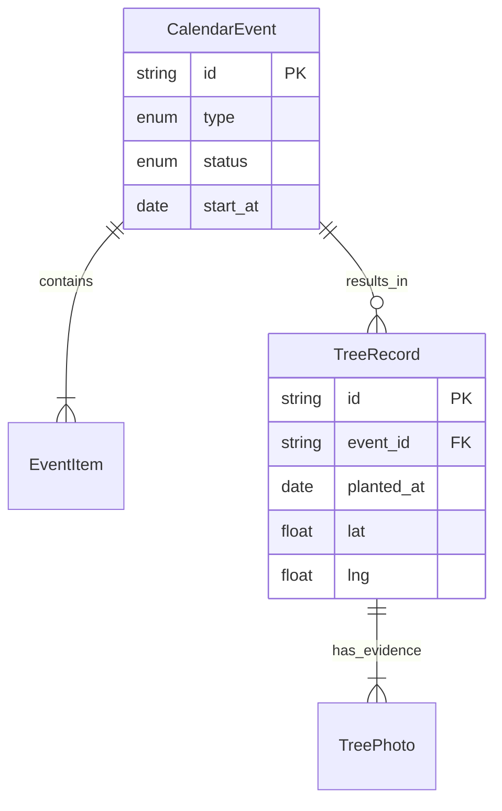

# Doménový Model SilvaPlan

Aplikace pracuje s několika klíčovými entitami, které reprezentují životní cyklus výsadby stromů.

## Core Entity

### 1. CalendarEvent (Plán)
Reprezentuje **záměr** provést akci v budoucnosti (nebo záznam o tom, že byla naplánována).

| Atribut | Typ | Popis |
|---------|-----|-------|
| `id` | string | Unikátní identifikátor |
| `type` | EventType | Typ akce: `planting` (výsadba) \| `maintenance` (údržba) \| `other` |
| `status` | EventStatus | Stav: `planned` \| `done` (hotovo) \| `canceled` |
| `title` | string | Název události (např. "Komunitní sázení") |
| `start_at` | Date | Datum a čas zahájení |
| `lat` / `lng` | number | Souřadnice místa konání |
| `items` | EventItem[] | Seznam položek (co se bude sázet) |

### 2. EventItem (Položka akce)
Specifikuje materiál použitý v rámci akce.

| Atribut | Typ | Popis |
|---------|-----|-------|
| `species_name_latin` | string | Latinský název dřeviny (např. *Tilia cordata*) |
| `quantity` | number | Počet kusů |
| `size_class` | string? | (Volitelné) Velikostní třída sazenic |

### 3. TreeRecord (Realizace)
Reprezentuje **fyzický strom**, který byl skutečně vysazen. Toto je "důkaz" o realizaci. Může, ale nemusí být přímo navázán na původní Event.

| Atribut | Typ | Popis |
|---------|-----|-------|
| `id` | string | Unikátní identifikátor stromu |
| `event_id` | string? | Odkaz na původní akci (pokud existuje) |
| `species_name_latin` | string | Druh stromu |
| `planted_at` | Date | Datum skutečné výsadby |
| `lat` / `lng` | number | Přesná GPS pozice stromu |
| `photos` | TreePhoto[] | Fotodokumentace |

### 4. MeteoAlert (Kontext)
Externí environmentální data ovlivňující plánování.

| Atribut | Typ | Popis |
|---------|-----|-------|
| `type` | string | Typ jevu: `drought`, `storm`, `heat`, `frost` |
| `level` | AlertLevel | Závažnost: `info`, `warning`, `danger` |
| `valid_from/to` | Date | Časová platnost výstrahy |

## Vztahy mezi entitami

## Enumy

### EventType
- **PLANTING**: Primární akce výsadby nových stromů.
- **MAINTENANCE**: Údržba (zálivka, řez, kontrola).
- **OTHER**: Jiné komunitní akce.

### AlertLevel
- **INFO**: Informativní zpráva (např. "V noci bude chladno").
- **WARNING**: Varování vyžadující pozornost (např. "Riziko sucha").
- **DANGER**: Kritická výstraha (např. "Silná bouře", akce by se měla zrušit).
